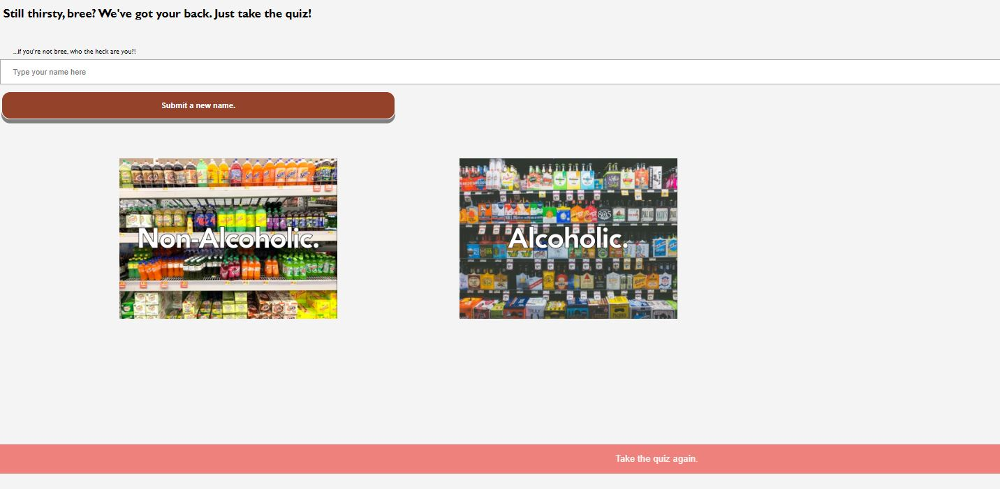

# BuzzedFeed

This is the BuzzedFeed application built by our team, Longshot Tornadoes.This application is here to quench your thirst.The user comes to our website and is able to chose a drink either alcoholic or non-alcoholic.
Just enter your name and click on your choice of drink(alcoholic or non-alcoholic) and we would recommend you a drink.If you are not happy with the selection just retake the quiz and we are happy to give you a new selection.

After you have made the selection you can visit our amazing recipe page were we have listed great recipes  for various drinks.We encourage you  to try those amazing recipes.

After you have enjoyed some of our drinks take the trivia on our Buzzedquiz page.4 questions to keep your mind running.

Lastly dont forget to visit our About Us page.Learn more about our team members who have worked really hard to build this amazing application.

## Site Sample




## Installation

OS X Windows & Linux:

```sh
clone repo to local machine
```
git clone https://breelong7.github.io/Longshot-Tornadoes/


## Release History

* 0.2.1
    * Dry up code, final changes for completed & functioning site
* 0.2.0
    * ADD: presentation.html, positivesAndOpps.html, game.html
* 0.1.1
    * Added styling, local storage to satisfy MVP
* 0.1.0
    * Part of MVP met with constructor function and events
* 0.0.1
    * Work in progress

## Info

Longshot Tornadoes - Sian Culligan, Bree Long, James Ruhashyankiko, Shubham Majumdar
Licensing - MIT
See LICENSE for more info


## Resources
- Inspired by BuzzFeed: https://www.buzzfeed.com/quizzes
- CSS Margin Tutorials: https://developer.mozilla.org/en-US/docs/Web/CSS/margin-inline
- CSS Box shadow tutorial: https://www.w3schools.com/cssref/css3_pr_box-shadow.asp
- Overlay effect: https://www.limelightonline.co.nz/blog/image-overlay-hover-effects-with-css/
- .slice info: https://www.w3schools.com/jsref/jsref_slice_string.asp
- Icon info:https://www.w3schools.com/tags/att_link_sizes.asp
- Text along a path (curved text): https://css-tricks.com/snippets/svg/curved-text-along-path/
- Zoom on hover: https://www.w3schools.com/howto/howto_css_zoom_hover.asp
- JAVA Script - W3Schools,Stackoverflow,codepen.io,google
